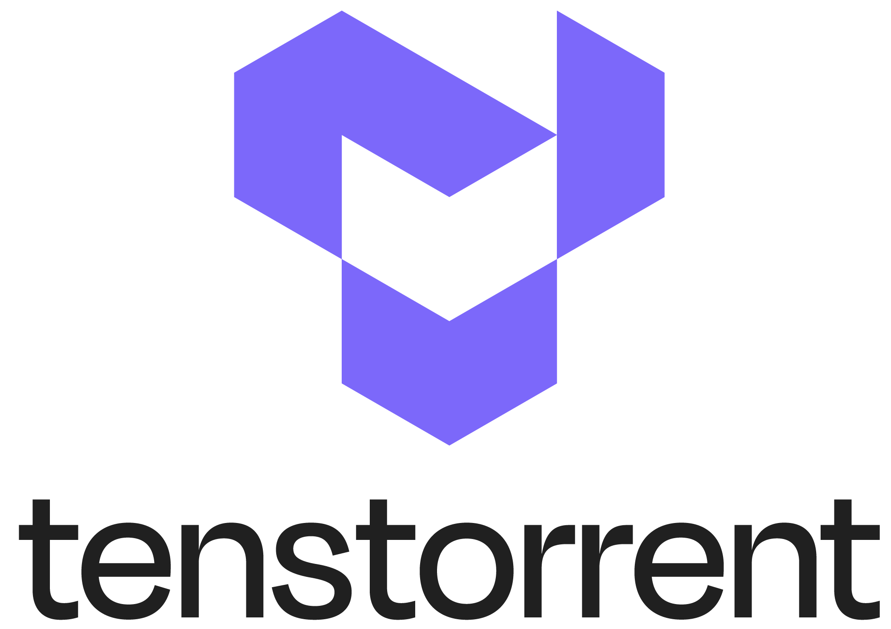

<div align="center">
<h1> TTExaLens </h1>

A low level hardware debugger



</div>
<br/>

TTExaLens is a low level debugging tool for Tenstorrent's hardware.
It can be used to access and communicate with the device.
At the moment, Grayskull and Wormhole devices are supported, while the support for Blackhole cards, as well as support for the Metal runtime are under development.

---

## Building TTExaLens

### Cloning repository and setting up the environment

After cloning the TTExaLens repository, be sure to run

```bash
git submodule update --init --recursive
git lfs install
git submodule foreach 'git lfs fetch --all && git lfs pull'
```

so that all the submodules are properly loaded.

### Requirements

TTExaLens has been tested on Ubuntu versions 22.04 and 20.04.

[//]: # (TODO: We should check this on vanilla system and also separate test, build and run dependencies, as per #)
To build TTExaLens, you need the following dependencies:

- software-properties-common,
- build-essential,
- python3.X-venv,
- libyaml-cpp-dev,
- libhwloc-dev,
- libzmq3-dev,
- xxd,
- ninja-build

which can be installed by running

```bash
sudo apt install software-properties-common build-essential libyaml-cpp-dev libhwloc-dev libzmq3-dev libgtest-dev libgmock-dev xxd ninja-build
```

Both python 3.8 and 3.10 are actively supported, so you can use either

```bash
sudo apt install python3.8-venv
```

or

```bash
sudo apt install python3.10-venv
```

depending on Python version available on your system.

Additional Python dependencies are listed in `ttlens/requirements.txt` file, and can be installed via `pip`:

```bash
pip install -r ttlens/requirements.txt
```

### Building the library and the application

Once the dependencies are installed, building TTExaLens should be straightforward, and is done simply by running

```
make build
```

in TTExaLens home directory.
To be sure that the build was succesful, try running

```bash
python tt-lens.py
```

or

```bash
./tt-lens.py
```

in the root directory.


## Building and Installing Wheel

Wheel can be installed either from the [GitHub release](https://github.com/tenstorrent/tt-lens/releases), built from source, or installed directly from GitHub with
```
pip install git+https://github.com/tenstorrent/tt-lens.git
```

To build TTExaLens wheel from source, simply run `make wheel` in the root directory. The installation is then done by running `pip install build/ttlens_wheel/<ttlens_wheel>.whl`, where `<ttlens_wheel>` is an automatically generated name unique for each build.

## Running TTExaLens

TTExaLens can be run through `tt-lens.py` script or by invoking `ttlens` command after wheel installation.
TTExaLens currently operates in Limited mode, with plans to extend functionality to include other modes in the future..
Limited mode is entered by default, and it enables basic communication with the device, like writing to and reading from registers or device memory and running .elf files on RISC cores.

TTExaLens can run locally or remotely.
For remote runs, a TTExaLens server is needed.
It can be started either through TTExaLens application.

It is also possible to write all the results from TTExaLens session to cache, and use them to run TTExaLens commands again on a system that does not have Tenstorrent hardware.

GDB server can be started from TTExaLens, allowing features like stepping through code and breakpoints to be used through GDB client.

For more information about how to use the TTExaLens application, refer to [the tutorial](./docs/ttlens-app-tutorial.md), or [the documentation](./docs/ttlens-app-docs.md).

## Using TTExaLens library

TTExaLens's functionalities can also be used through ttlens library to create Python scripts that interact with Tenstorrent's hardware.
For a quick start with ttlens library, check out [the tutorial](docs/ttlens-lib-tutorial.md).
Full documentation is also available [here](docs/ttlens-lib-docs.md).

## Development

### Testing TTExaLens

#### Test dependencies

Apart from the base TTExaLens dependencies, tests require additional python packages:

- pytest,
- coverage,
- parameterized,

and system libraries:

- libgtest-dev,
- libgmock-dev,

which can be installed by running

```bash
pip install -r test/test_requirements.txt
```

#### Running tests

It is currently possible to run tests locally, by running

`make test`

from the project root directory.

### Updating documentation

In order to update documentation virtual environment has to be created first by running the following command:

```bash
./scripts/create-venv.sh
```

To activate created environment use

```bash
.venv/bin/activate
```

Library documentation is automatically generated from source code docstrings.
To update the library docs, you need to run (while in created environment):

`make docs`

in the project root.
For more advanced use cases, refer to the source code of the documentation generation scripts, located in `docs/bin`.

### Static checks

#### Pre-commit

We have defined various pre-commit hooks that check the code for formatting, licensing issues, etc.

To install pre-commit , run the following command:

```sh
pip install pre-commit
```

After installing pre-commit, you can install the hooks by running:

```sh
pre-commit install
```

Now, each time you run `git commit` the pre-commit hooks (checks) will be executed.

If you have already committed before installing the pre-commit hooks, you can run on all files to "catch up":

```sh
pre-commit run --all-files
```

For more information visit [pre-commit](https://pre-commit.com/)

### Updating docker images

To update docker images used on CI and in development, you need to update Dockerfiles in `.github` directory and then run [`release-docker-images`](.github/workflows/release-docker-images.yaml) workflow.
This can be done through GitHub CLI (see [here](https://github.com/cli/cli?tab=readme-ov-file#linux--bsd) how to install it) by using command

```bash
gh workflow run 116548537 --ref <your-branch-name>
```

This will automatically generate new image releases and tag them as `latest`.

---


## Troubleshooting

### fatal error: zmq.hpp: No such file or directory

```
In file included from ttlens/server/lib/inc/ttlensserver/server.h:8,
                 from ttlens/server/app/ttlens-server-standalone.cpp:11:
ttlens/server/lib/inc/ttlensserver/communication.h:9:10: fatal error: zmq.hpp: No such file or directory
    9 | #include <zmq.hpp>
```

This happens when the docker image does not contain the required dependencies.
Fix:
```
sudo apt update && sudo apt-get install -y libzmq3-dev libgtest-dev libgmock-dev
```


### python: command not found
```
test/wheel-test/wheel-test.sh: line 11: python: command not found
make: *** [Makefile:182: test] Error 127
```
Fix:
```
alias python=python3
```


### ModuleNotFoundError: No module named 'ttlens_pybind_unit_tests'

This error might occur when trying to run unit tests:
```
Failed to import test module: test.ttlens.pybind.test_bindings
Traceback (most recent call last):
  File "/usr/lib/python3.10/unittest/loader.py", line 436, in _find_test_path
    module = self._get_module_from_name(name)
  File "/usr/lib/python3.10/unittest/loader.py", line 377, in _get_module_from_name
    __import__(name)
  File "/home/dcvijetic/work/tt-lens/test/ttlens/pybind/test_bindings.py", line 17, in <module>
    from ttlens_pybind_unit_tests import set_ttlens_test_implementation
ModuleNotFoundError: No module named 'ttlens_pybind_unit_tests'
```
To fix, just build the neccessary test library:
```
make build
```
