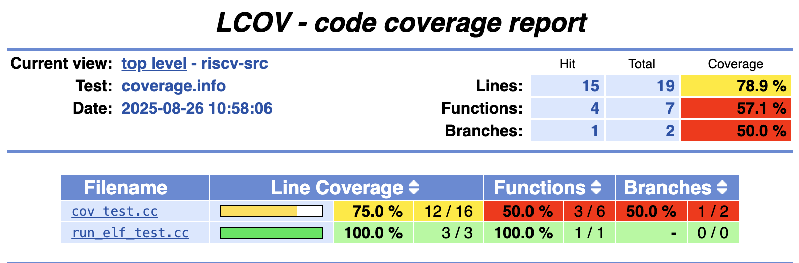

# Test coverage analysis with gcov



## Quick start

To quickly get coverage info for your kernels, you can use our repo:
1. Drop your kernels into [`riscv-src`](../riscv-src/), add them into `RISCV_APPS`, and run `make` in the project root. This will compile debug, release and coverage binaries.
2. Run them and extract their coverage info:

```bash
mkdir coverage
./tt-exalens

re build/riscv-src/wormhole/foo.coverage.trisc0.elf -r trisc0
re build/riscv-src/wormhole/bar.coverage.trisc1.elf -r trisc1
cov build/riscv-src/wormhole/foo.coverage.trisc0.elf coverage/foo.gcda coverage/foo.gcno
cov build/riscv-src/wormhole/bar.coverage.trisc1.elf coverage/bar.gcda coverage/bar.gcno
exit
```
3. Get your coverage report by running:
```bash
./scripts/merge-coverage.sh coverage cov_report
```
Afterwards, just open `cov_report/index.html`. Mind that the script uses `lcov`, so you may need to install it.

***

## How to enable coverage in your workflow

If you wish to integrate gcov into your project, some build adjustments will be needed (you can copy our `.ld` files and CRT, and skip to the build script changes):
- Linker script changes:
  - Make sure your memory layout can handle the increase in code and data size. It's recommended to move data out of L0 (the `0xFFB00000` region) and only leave the stack there.
  - Allocate a memory region for each RISC to store its coverage data (for instance, `BRISC_GCOV_MEM`, `TRISC0_GCOV_MEM`, etc.)
  
    (Take a look at [`memory.wormhole.debug.ld`](../riscv-src/memory.wormhole.debug.ld) as an example.)
  
  - Alias each RISC's new region (`REGION_ALIAS("REGION_GCOV", BRISC_GCOV_MEM)` and so on, as seen in [`brisc.ld`](../riscv-src/brisc.ld), [`trisc0.ld`](../riscv-src/trisc0.ld), etc.)
  - Add the following to the `SECTIONS` part of your linker scripts (as seen in [`sections.ld`](../riscv-src/sections.ld)):
  ```GNU ld
  .gcov_info :
  {
    __gcov_info_start = .;
    KEEP(*(.gcov_info))
    KEEP(*(.gcov_info.*))
    __gcov_info_end = .;
  } > REGION_DATA
  __coverage_start = ORIGIN(REGION_GCOV);
  __coverage_end = ORIGIN(REGION_GCOV) + LENGTH(REGION_GCOV);
  ```
- C runtime changes (present in [`riscv-src/tmu-crt0.S`](../riscv-src/tmu-crt0.S)):
  ```asm
  #ifdef COVERAGE
  call gcov_dump
  #endif
  ```
  Make sure your CRT gets preprocessed before being assembled (GCC does this automatically if the file extension is `.S`).
  Alternatively, you can ignore the CRT and manually call `gcov_dump` at the end of every kernel.
- Build script changes (present in [`riscv-src/CMakeLists.txt`](../riscv-src/CMakeLists.txt)):
  - Add `-fprofile-arcs -ftest-coverage -fprofile-info-section -DCOVERAGE` to your compiler flags.
  - Compile two additional source files: [`gcov.c`](../riscv-src/coverage/gcov.c) and [`coverage.c`](../riscv-src/coverage/coverage.c) into object files.
  - Link every kernel with those two object files.
  - Make sure you use the changed linker scripts when compiling for coverage.

Now you can run your kernels as per usual. You can run multiple coverage kernels at the same time with no issues (they all work with their separate parts of memory).
After a kernel completes, pull its gathered coverage data with the `dump-coverage` (`cov`) command in exalens: specify the path to the executed ELF, the output gcda path, and optionally the output gcno path.
Once you've done that for all kernels, use any tool you wish to process the gathered data. `lcov` is one of them.
We provide, as shown in [Quick start](#quick-start), the [`merge-coverage`](../scripts/merge-coverage.sh) shell script to automate this part.

***

## Implementation overview

When compiling for coverage, GCC does the following:
- Allocates space in the executable for profiling counters that get incremented as code executes.
- Instruments the code with instructions to increment the counters: most basic blocks have a counter which they bump when they are executed.
- Generates at compile time gcno (note) files for each translation unit. They describe that unit's CFG, which branches and blocks exist, and what the overall structure of the code looks like. The note files let the compiler map the raw counters back to the source code.
- Inserts a call at program exit to collect the counters and pack them into a gcda (data) file which then contains that run's profiling and coverage data.

Afterwards, tools like gcov and lcov can use the gcno-gcda pair to produce a coverage report.

## Implementation details

Under the hood, GCC’s profiling and coverage machinery presupposes two things: global constructors and destructors that initialize and dump the counters, and a filesystem to store the gcda files at program exit. Neither presupposition holds for us.

However, GNU gentlemen had a usecase such as this in mind, so they provided the [-fprofile-info-section](https://gcc.gnu.org/onlinedocs/gcc-15.1.0/gcc/Freestanding-Environments.html) compiler flag, which makes it relatively straightforward to make profiling and coverage work on freestanding devices without having to resort to hacks like semihosting. The basic idea is removing the need for global constructors (to initialize the counters) and destructors (to dump the gathered data), and instead statically initializing the data and letting the programmer walk the counters manually to extract them over any medium of communication at his disposal.

The compiler accomplishes this by essentially cramming the coverage counters into `.bss`, turning off the global ctors and dtors (in `.init`/`.init_array`, `.fini`/`.fini_array`) for gcov stuff, and exposing a pair of iterators (`__gcov_info_start` and `__gcov_info_end`) which point to per-TU data (`struct gcov_info`).

Making gcov work on our hardware involved a few things:
1. Compiling with `-fprofile-arcs -ftest-coverage -fprofile-info-section`
2. Exposing the data in L1
3. Extracting the data onto the host system

---

### 1. Compiling

This is a lot more involved beyond mechanically adding the compiler flags and typing `make`.

Just telling GCC to compile with `-fprofile-arcs -ftest-coverage -fprofile-info-section` will pull in libgcov, which then pulls in the entirety of the C standard library I/O (from newlib), which made my first attempt at compiling fail spectacularly (with 60KiB+ `.text` section overflows).

Linker script adjustments were immediately necessary. The private memory region (or L0 if you will) got bloated, so I placed it into L1 and let only the stack reside in L0. I also added a new region where the coverage data stream in gcda format will be written into, and hacked together a minimal library for extracting coverage data; more on those topics in [2. Converting counters into gcda and exposing it](#2-converting-counters-into-gcda-and-exposing-it).

If you skim through the tutorial provided in the GCC docs linked above, you may notice they note some linker script changes necessary for `-fprofile-info-section` to work:

```GNU ld
.gcov_info :
  {
    PROVIDE (__gcov_info_start = .);
    KEEP (*(.gcov_info))
    PROVIDE (__gcov_info_end = .);
  }
```

I have noticed that the `PROVIDE` directive does not get the job done for us, so I exposed the symbol with the plain `__gcov_info_start = .` statement. Mind that the `KEEP` directives are necessary for the linker to not discard this section as unused.

Note: don't try instrumenting with `-fprofile-topn` or `-fprofile-values`, as these may require runtime heap allocation. In case those options are ever needed, make sure you link in `write_topn_counters` from `libgcov-driver.c` and write a heap allocator. The allocation function must be passed to `__gcov_info_to_gcda`.

More linker script tweaks may be necessary depending on the nature of the instrumented kernels. In case there's an overflow in `.text` or some other such problem, simply expanding the region should get the job done. The numbers present in my scripts are more than sufficient for anything I've tested with.

---

### 2. Converting counters into gcda and exposing it

libgcov provides `__gcov_info_to_gcda` (found in `gcc/libgcc/libgcov-driver.c`) which converts raw counter info into the gcda format that can later be used by tools like `gcov` and `lcov`. However, as already mentioned, linking against libgcov turned out to be a problem (as we don't want all of newlib). That function itself does not have any libc dependencies, so I copied the minimal required implementation of `__gcov_info_to_gcda` and its dependencies from GCC's codebase into `gcov.c`, which should then be linked into kernels compiled for coverage.

The counters for each kernel, its pointer to the `struct gcov_info`, and the struct itself, are all in its `.ldm_data` (the counter being in the `bss` portion, unlike the other two). When the kernel ends, the C runtime `tmu-crt0.S` calls `gcov_dump`, which passes that pointer to `__gcov_info_to_gcda`, which then gives us a data stream in gcda format. The linker scripts define `REGION_GCOV` (as well as two symbols to access it: `__coverage_start` and `__coverage_end`), and we write a short header and then the data stream as a byte array into that region.

There is no need to iterate from `__gcov_info_start` to `__gcov_info_end` as only one `struct gcov_info` is present (since this was built with only one TU per kernel in mind). This also simplifies more things that the tutorial mentions - `gcov-merge-tool` is unnecessary, and so is the filename prefix function (for the most part). Namely, that function (`coverage.c:filename`) receives the filename string from `struct gcov_info`, which is the expected output path for the gcda, and it will be in the same directory as where the compiler placed the gcno. We use this to later find the gcno if so asked. `filename` merely writes the pointer it receives and the length of the string into the second and third word in the region, respectively. To be clear, this is not a requirement of the gcda format; this is done to make `cov` calls simpler and safer. The actual gcda begins after the first 12 bytes of the region.

The layout of the coverage region is as follows (in word granularity, i.e. 4 bytes):

```
REGION_GCOV (__coverage_start...__coverage_end)
- [0] length in bytes of the data in the region (including the header)
- [1] pointer to the filename (`struct gcov_info.filename`)
- [2] length of the filename string
- [3...] gcda data stream
```

Should it ever be necessary to support coverage for multiple TUs simultaneously, adding that would involve:
- Iterating from `__gcov_info_start` to `__gcov_info_end` and calling `__gcov_info_to_gcda` for each `struct gcov_info`
- Adjusting `coverage.c:filename` to call `__gcov_filename_to_gcfn

---

### 3. Storing the data on the host

`tt-exalens` can extract the data for you with the `dump-coverage` (or `cov`) command. You merely supply the path to the currently running ELF for which you want to gather coverage data, and where you want to output it. Optionally you may provide where you want the original gcno (inferred from `struct gcov_info.filename`) to be placed. It walks the symbol table, finds `__coverage_start`, reads the header (length, filename pointer, `strlen(filename)`) and extracts the gcda and optionally gcno. When you've run this command for every ELF whose coverage you wanted, you may wish to run `scripts/merge-coverage.sh` on the directory with the gcno-gcda pairs, which will call `lcov` and `genhtml` for you so that you can just open the html afterwards.
