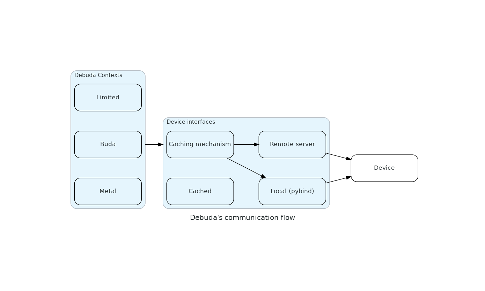

# Using TTLens library in Python scripts

It is possible to use functions from TTLens library in custom scripts in order to access low-level device functionality (e.g. read from L1 registers, or run .elf files on RISC cores).
These functions are exposed through two modules in ttlens package: tt_debuda_init and tt_debuda_lib.
In this tutorial, we will demonstrate how to use TTLens library through a few simple examples.


## Setting up TTLens

To follow this tutorial, you need a virtual environment with installed TTLens wheel.
TTLens wheel can be installed from [this link](https://github.com/tenstorrent/tt-debuda/releases).
Publishing the wheel to PyPI is in the works.
It is also possible to [build wheel from source](../../README.md#building-and-installing-wheel).


## TTLens internal structure and initialization

Once you have an environment with TTLens installed, you can start using it in your scripts.
There are two main modules intended to be used as access point to TTLens functionalities: `tt_debuda_lib` and `tt_debuda_init`.
The former exposes functionalities like reading from and writing to device memory, or running .elf files and the latter is used to initialize TTLens and set up connection to the device.

The structure of the debugger is layered, allowing TTLens to acces the device in multiple manners with various ways to provide it context about what is happening on the chip.
The are three layers a typical API call passes through when TTLens command is invoked: context, device interface and caching mechanism.

<div align="center">

</div>

**TTLens context** is the highest-level class when connecting to the device through TTLens. It provides TTLens with additional information about what's happening on the device. 
For example, when debuggind a Buda model, context can provide TTLens with model graph and netlists, which in turn allow for better semantics in hardware acces, like reading tiles instead of just memory addresses.
There are three contexts TTLens can work in.
If no output directory is specified, TTLens is run in limited context, allowing for basic operations on device memory and running .elf files.
If an output directory is specified when initializing TTLens, it can run in Metal or Buda contexts, with acces to higher-level information that allows for more structured interactions with the device beyond just reading and writing in memory addresses, as various structures can be deduced based on additional info.
Currently, **only Limited and Buda contexts** can be used, and Metal support is in the works.

**Device interfaces** allow for different ways of communication with Tenstorrent hardware.
You can initialize TTLens locally, in which case device interactions are done through Python bindings of C++ wrapper for [tt-UMD library](https://github.com/tenstorrent/tt-umd).
If you need to debug a remote device, you can spin a TTLens server, either through standalone TTLens app or Buda runtime.
It is then possible to connect to the server and use TTLens in remote mode.

**Caching mechanism and cached interface** allow TTLens to save results of invoked commands and use them to rerun a session when device is not accessible.
If caching is turned on in local or remote interface mode, every return value of TTLens's functions is saved in output pickle file.
Should it be needed to inspect output of these function calls again on a host that does not have access to Tenstorrent hardware, TTLens can be started with cached interface, in which case it can use return values saved in the cache pickle file.
In the case of using cached ifc, it is only possible to rerun cached function calls.


## A simple TTLens program

This section demonstrates how to make a simple script using TTLens library. For a more complete oevrview of Debdua's abilities, check out [the full documentation](library-docs.md).

```python
from ttlens.tt_debuda_init import init_debuda
from ttlens.tt_debuda_lib import write_to_device, read_words_from_device

context = init_debuda()
data = [1, 128, 18, 64]

num_bytes = write_to_device("0-0", 0x100, data, context=context)

read_data = read_words_from_device("0-0", 0x100, word_count = 1)

read_data = read_data[0].to_bytes(4, 'little')
read_data = list(read_data)
print(read_data)
```

The code snippet above performs a simple task of writing a list given by `data` variable to adress `0x100` on core `0-0`.

TTLens library package is called `ttlens`. 
It contains multiple modules, three of which are interesting to external user:
- _tt_debuda_init_: A module containing various functions for device and context initialization.
- _tt_debuda_lib_: A module containing useful functions for device interactions.
- _tt_coordinate_: A module useful for advanced specification of device core coordinates.

The command `context = init_debuda()` initializes a new default TTLens context and establishes a connection to the device.
Had we passed `<output-dir>` of a Buda run to this function, TTLens would have used that additional info to initialize a Buda context.

The initialization step is done implicitly on the first call to a function that interacts with the device.
The implicit initialization is always done with Limited local context.
In functions `write_to_device` and `read_words_form_device`, the optional context parameter is not necessary, and indeed `read_data` will implicitly used our `context` object.
If a context is not specified, the functions will use the active context, or will create a new context if no active context exists.
Active context is the most recently initialized context, or the context set through `set_active_context` function.
Beware that every new initialization overwrites currently active context.

Both `write_to_device` and `read_words_from_device` take as first two parameters a core coordinate and a memory address.
There are a few ways to pass a core coordinate to a function.
If you pass a string, it can be in the form of
	
- "X-Y", where it is interpreted as nocTr coordinate, or
- "X,Y", where it is interpreted as a netlist coordinate.

It is also possible to create an `OnChipCoordinate` object for more advanced use cases. For more details on this approach, please refer to [the documentation](library-docs.md#tt_coordinate).
One notable thing about `OnChipCoordinate` objects is that they need to have a device specified on construction for coordinate transforms to be possible (due to device specifics, like different architectures and harvesting within one architecture).
Not specifying a device results in an error.
It is possible to access available devices through the `Context` object, so an example object construction could look like this:

```python
coordinate = OnChipCoordinate(1, 1, 'noc0', context.devices[0])
```

Other functions that can take a list of coordinates as a parameter (such as `run_elf` function) also support all the ways of specifying coordinates listed above.
Such a list may also contain mixed coordinate specification.

[//]: # (TODO: Someone should check this paragraph)
Bear in mind that not all addresses existing on the device are always available.
For example, addresses in the form of `0xFFBNNNNN` are only available through device debug interface.

The function `write_to_device` is intended to be used for writing raw data to device memory.
It takes data to be written either as a `bytes` object or as a list of 8-bit integers.
In the case of a list, each element represents one byte that will be written to the device, so in the example above, we are writing 4 bytes.

In the call to `write_to_device`, we have explicitly specified a context to be used for device communication.
This explicit specification is possible with all library functions that use the context, but is not neccessary.
The call to `read_words_from_device` does not specify a context, so a currently active context is implicitly used.
In our case, as the `context` object is the most recently initialzied one, both functions will use it.
This function returns number of bytes written.

Tenstorrent processors use 32-bit words.
Functon `read_words_from_device` is intended for reading for reading 4 bytes (one word) at a time.
`word_count` specifies how many words will be read in a function call.
In our case, since we have written 4 bytes to the device at address `0x100`, we want to read only one word.

The return value of `read_words_from_device` is `list[int]`, where each integer is 32-bit.
To check more easily if our program did, in fact, read the original data we had written, we want to convert the original 32-bit integer into a list of 8-bit ones. 
The last three lines first convert the integer to a 4-byte long `bytes` object, and then convert the resulting `bytes` object to a list of 8-bit integers.
It is worth noting that the device uses little-endian byte order.


## Running .elf files

TTLens library can be used to run .elf programs on RISC cores.
Let's take a look at this simple program:

```cpp
#include <cstdint>
#include <stdint.h>

extern void (* __init_array_start[])();
extern void (* __init_array_end[])();

#define RISCV_L1_REG_START_ADDR             0x00000000

extern "C" void wzerorange(uint32_t *start, uint32_t *end)
{
    for (; start != end; start++)
    {
        *start = 0;
    }
}

int main() {

	// Initialize some intrinsic functions
	for (void (** fptr)() = __init_array_start; fptr < __init_array_end; fptr++) {
 	    (**fptr)();
	}

    volatile uint32_t *MAILBOX = reinterpret_cast<volatile uint32_t *> (RISCV_L1_REG_START_ADDR);
	*MAILBOX = 0x12345678;

	for (;;);	
}
```

Ignoring all the code used for initialization and compiler compliance, this program  writes the value `0x12345678` into L1 memory at address `0x0`, and then enters an infinite loop.
To compile the .elf file, you can simply run `make build` and use the output generated in `build/riscv-src/wormhole/run_elf_test.brisc.elf`.
It can then be run on a brisc core through the TTLens library.

```python
from ttlens.tt_debuda_lib import run_elf, read_words_from_device

run_elf("build/riscv-src/wormhole/run_elf_test.brisc.elf", "1-1")

ret = read_words_from_device("1-1", 0x0)
print(hex(ret[0]))
```

In the example above, we run the .elf file and then read the value that should be written to address `0x0` at core `1-1`.

`core_loc` parameter of `run_elf` function can either be a string specifying a single core, `OnChipCoordinate` object, `all` keyword (in which case the program is run on all available cores) or a list consisting of the first two options for specifying multiple cores.

It is also possible to run programs on both brisc and trisc cores, by specifying the `risc_id` parameter.
ID 0 targets a brisc core, while IDs 1-3 target trisc cores.

To see more options when running elf files, refer to [the documentation](library-docs.md#run_elf).


## Further reading

For more information about the TTLens library, check out [the documentation](library-docs.md#tt_coordinate).